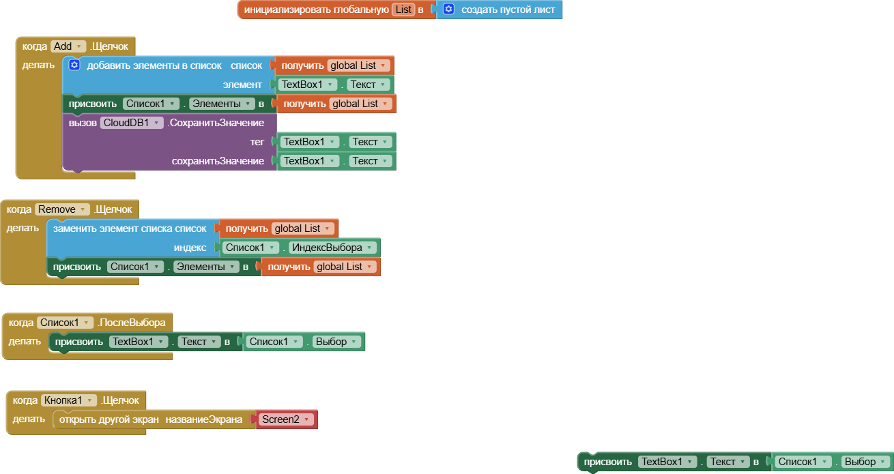

# biosample-cloud-tracker
Cloud-based Android application for real-time laboratory inventory and sample tracking. Developed using MIT App Inventor
# BioSample Cloud Tracker

A cloud-based Android application developed using MIT App Inventor for real-time laboratory inventory management.

## Key Features
* **Cloud Synchronization:** Uses `CloudDB` to sync lists across multiple devices (perfect for lab teams).
* **Dynamic Inventory:** Add and remove items (reagents, DNA samples, primers) on the go.
* **Persistent Storage:** Data is stored remotely and persists even after closing the app.

##  Tech Stack
* **Platform:** Android
* **Environment:** MIT App Inventor
* **Backend:** CloudDB (Redis-based)

## Logic Overview
The app utilizes event-driven programming blocks to handle data input, selection picking, and cloud storage triggers.

## Application Logic (Blocks)

### Data Addition and Cloud Sync
This part handles input validation and stores entries into the CloudDB.

### Selection and Navigation
Logic for picking items from the list and switching between screens.
.png)

## Algorithm Workflow:

Input: User enters a sample name in TextBox1.

Local Update: The item is added to the global List variable and displayed in ListView.

Cloud Sync: The app calls CloudDB.StoreValue using the sample name as both the Tag and the Value, ensuring data is saved on the server.

## How to Test:

Download the BioSample_Tracker.apk from this repository.

Install it on your Android device (enable "Unknown Sources").

Alternatively, import the .aia file into MIT App Inventor to view the source blocks.

## Roadmap / Future Improvements
* **QR/Barcode Integration:** Use the phone's camera to scan tubes and instantly find sample data.
* **Export to CSV/Excel:** Ability to send the current inventory list to email for documentation.
* **Expiration Alerts:** Automated notifications for reagents with upcoming expiry dates.
* **Offline Mode:** Local caching of data when Wi-Fi in the lab is unstable.
